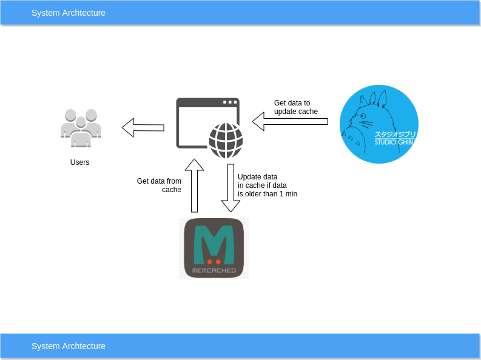
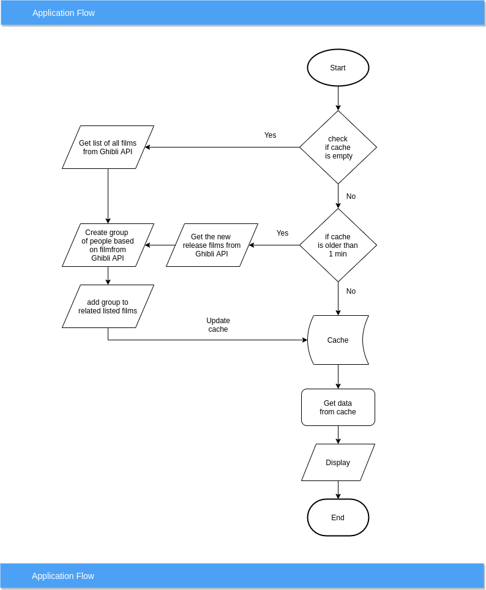

# ghibli API
Flask application to serve data from ghibli api

#### Description:
1. Memcache server used to store cache.
2. If cache does not exist then it will create the cache and serve the data
3. If cache exist then check if cache is not older than one min then get the data from cache and serve the data
4. If cache exist but older than one minute then compare the data and check new release on ghibhi and if we find any new release then append the data in existing cache and serve the data

### Requirement:
* Python
* Flask
* Memcache
* docker

### Architecture
#### System Architecture:

#### Solution Architecture:

<br/>You can open the architecture design in draw.io also by
opening https:draw.io and select the file system_architecture.drawio

#### Folder Structure:
    --ghibli(main application)
      --src
        --__init__.py
        --config.py
        --ghibhi.py
        --service.py
      --templates
        --index.html
      --test
        --__init__.py
        --base.py
        --test_cache.py
        --test_ghibhi.py
        --test_movie.py
        --test_people.py
        --test_servive.py
      --__init__.py
      --app.ini
      --docker-local-entrypoint.sh
      --local.Dockerfile
      --requirement.txt
      --run.py(main file to run application)
    --nginx
    --docker-compose.yml
    --traefik.toml(to monitor the trafic with list of url)
#### Step-1
1. Install Docker 
2. git clone https://github.com/sbsanjaybharti/ghibli_api.git
3. I am assuming Docker is already install in your system if not then follow this link https://docs.docker.com/get-docker 
3. Open the terminal in main folder and run the command<br/>
```ubuntu
docker-compose build
docker-compose up
```
#### Step-2
1. open the link http://nginx.localhost/movies.
2. To run the test cases open new terminal in same folder and run the command
```python 
docker-compose exec ghibli /bin/bash 
python run.py test
``` 
first command will take you in the container and second command to run the test.
3. To test PEP8 status
```python 
docker-compose exec ghibli /bin/bash 
python -m pylint <filename>
``` 
first command will take you in the container and second command to run the pylint.
replace <filename> with actual file name eg. run.py, src/service.py and so on

 
#### Design pattern:
1. Design pattern:
    a. Creational: Builder, Factory design pattern
    b. Structural: Proxy and Bridge design pattern
    c. Behaviral: Mediator and Chain of responsibility design pattern
 
##### Feature:
1. Memcache used to handle the load on application
2. Panda library is used  to handle big data to process CSV.
3. Swagger to display the API.
4. Application can handle large number of data without user waiting time.
